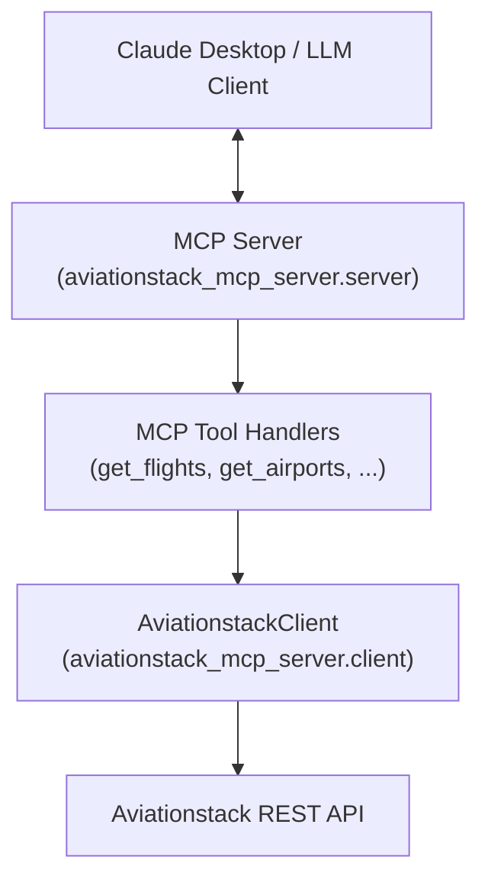

# Aviationstack MCP Server (Python)

A Model Context Protocol (MCP) server that provides access to global aviation data via the Aviationstack API.

## Features

- **Tools** (aviationstack_* prefix):
  - `aviationstack_get_flights`: Real-time and historical flight data
  - `aviationstack_get_airports`: Global airport search
  - `aviationstack_get_airlines`: Global airline search
  - `aviationstack_get_routes`: Airline routes data
  - `aviationstack_get_airplanes`: Aircraft information
- **Resources**: `aviationstack://docs` documentation
- **Prompts**: `aviationstack_flight_search` template
- **Output schema**: Structured response (meta, items, raw)

## Setup

1.  **Environment Variable**: Obtain an API key from [Aviationstack](https://aviationstack.com/) and set it as an environment variable:
    ```bash
    export AVIATIONSTACK_API_KEY=your_api_key_here
    ```

2.  **Installation**:
    ```bash
    pip install .
    ```

## Running

The server uses the `stdio` transport, making it compatible with MCP clients like Claude Desktop.

```bash
python -m aviationstack_mcp_server.server
```

## Configuration for Claude Desktop

Add this to your Claude Desktop configuration file:

```json
{
  "mcpServers": {
    "aviationstack": {
      "command": "python",
      "args": ["-m", "aviationstack_mcp_server.server"],
      "env": {
        "AVIATIONSTACK_API_KEY": "your_api_key_here"
      }
    }
  }
}
```

## Testing

```bash
pip install ".[dev]"
pytest
```

## Architecture and Resilience

### High-Level Architecture



At a high level, the MCP server is responsible for:

- Translating MCP tool invocations into calls on a dedicated `AviationstackClient`.
- Normalizing external API responses into a stable internal schema.
- Mapping transport- and provider-level failures into structured error payloads that are safe for LLM consumption.

This separation keeps the MCP surface small and declarative, while concentrating operational concerns (timeouts, retries, rate limits) inside the client layer.

### Error Abstraction Layer

All external failures are funneled through a thin error abstraction:

- **`AviationstackErrorPayload`**: a structured, provider-agnostic error shape containing:
  - `provider`, `code`, `message`, `status_code`
  - `retryable`, `rate_limited`, `retry_after_seconds`
- **`AviationstackAPIError`**: a domain-specific exception that wraps the payload and is raised whenever:
  - The API embeds an error object in an otherwise successful HTTP response.
  - The HTTP status code indicates failure (4xx/5xx).
  - Network- or timeout-level exceptions occur.

The MCP tool handlers never interact with raw `httpx` errors or provider-specific JSON directly. Instead, they:

1. Call `AviationstackClient.fetch(...)`.
2. Catch `AviationstackAPIError`.
3. Serialize the underlying `AviationstackErrorPayload` into a JSON object and return it as tool output.

This approach ensures that:

- The LLM always sees a consistent error contract, independent of the underlying HTTP library or provider quirks.
- Operational metadata (e.g. whether the error is retryable, or was caused by rate limiting) is preserved for higher-level orchestration or reasoning.

### Retry, Backoff, and Rate-Limit Handling

The `AviationstackClient` centralizes resilience policies:

- **Configurable timeouts and retries**
  - `AVIATIONSTACK_TIMEOUT_SECONDS` – per-request timeout (default: `10` seconds).
  - `AVIATIONSTACK_MAX_RETRIES` – maximum number of retry attempts for transient failures (default: `2`).
  - `AVIATIONSTACK_RETRY_BACKOFF_SECONDS` – base backoff interval for retries (default: `0.5` seconds).
  - Backoff follows a simple exponential pattern: `backoff * 2^(attempt-1)`.

- **Retry classification**
  - Network errors and timeouts are treated as `retryable=True`.
  - HTTP 5xx responses are `retryable=True`.
  - Rate-limited responses (`429` or provider error codes/messages indicating quota or rate limiting) are marked as both `retryable=True` and `rate_limited=True`.

- **Rate-limit awareness**
  - If the provider sends a `Retry-After` header, it is parsed into `retry_after_seconds` on the error payload.
  - Even when the client ultimately gives up (maximum retries exceeded), the MCP layer still surfaces whether the failure was due to rate limiting and how long the client suggested waiting.

By pushing this behavior into the client, tool handlers remain declarative while still benefitting from robust, centrally managed resilience policies.

### Response Normalization for LLM Tool Usage

Raw Aviationstack responses vary somewhat across endpoints (e.g. different pagination structures or additional fields). To make the server easier to use from LLM tools, each successful call is normalized into the following internal schema:

```json
{
  "meta": {
    "provider": "aviationstack",
    "resource": "flights | airports | airlines | routes | airplanes",
    "page": 1,
    "per_page": 100,
    "total": 1234
  },
  "items": [
    { "..." : "domain object" }
  ],
  "raw": { "..." : "full provider payload" }
}
```

Key design motivations:

- **Stable shape for prompting** – Tool-using prompts can rely on `meta` + `items` consistently, regardless of which endpoint is being called. This reduces the amount of schema-specific logic that has to be encoded in prompts.
- **Lossless access to provider data** – The original payload is always available under `raw` for advanced reasoning, debugging, or cases where a field has not yet been elevated into the normalized schema.
- **Future extensibility** – Additional providers can be added later by adopting the same `{ meta, items, raw }` contract, allowing composite tools and higher-level agents to treat multiple sources uniformly.

For tool consumers (including LLMs), this normalization significantly simplifies reasoning:

- Tool results can be summarized or filtered by iterating over `items` without inspecting provider-specific nesting.
- Meta-information such as pagination details is always available in the same location.
- Error responses reuse the same pattern via `{"error": AviationstackErrorPayload}`, so branching logic in prompts and orchestrators can remain concise and consistent.
